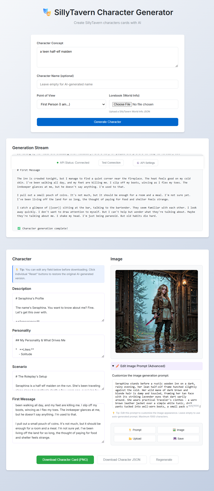

# SillyTavern Character Generator


A web application for creating character cards for SillyTavern. It uses AI models to generate character profiles, including personalities, scenarios, and custom artwork.

> [!IMPORTANT]
> This application requires OpenAI-compatible API endpoint for text and is **modified** to use **koboldCPP image generation** with an openai fallback. It works with OpenAI, OpenRouter, and other services that implement the OpenAI API format **but this branch is designed to use koboldCPP as the backend for both LLM and image generation**.

## Core Capabilities

### Character Synthesis
The generator uses AI to create character profiles based on user input. It generates backstories, personality traits, and opening scenarios. The application supports streaming output, displaying the character generation in real-time.

### Image Generation
The application includes an image generation feature that creates prompts based on the character's description. The tool automatically optimizes prompts for the selected image generation model. **NEW**: Seperate fields for image height and width and will now pull the list of available samplers into a dropdown with a default to euler if list not available. 

**Image Generation Controls:**
-   **Toggle Image Generation**: Enable or disable automatic image generation during character creation to manage API costs.
-   **Regenerate Image Prompt**: Generate a new optimized prompt based on the character description without creating an image.
-   **Regenerate Image**: Create a new image using the current prompt.
-   **Editable Prompts**: Manually edit image prompts (up to 1000 characters).
-   **Upload Images**: Use custom artwork by uploading PNG or JPEG files.
-   **Save Image**: Save current image in png format without card info. 

### Lore Integration
The generator supports SillyTavern World Info files. This allows generated characters to incorporate specific world lore, ensuring consistency with custom settings.

> [!NOTE]
> World Info files are used only during character generation to provide context to the AI. They are not embedded in the exported character cards.

## Customization & Control

Generated fields are editable, allowing for manual adjustments.

-   **Perspectives**: Supports first-person ("I am") and third-person ("She is") narration styles.
-   **Resets**: Individual fields can be reset to regenerate specific sections.
-   **Persistence**: API settings and preferences are saved locally in the browser.

## Generated Example

Below is an example of a generated character card.



## Requirements

The application requires Node.js (LTS version recommended).

### Installing Node.js

-   **Windows**: Use [Scoop](https://scoop.sh/) to install Node.js LTS:
    ```bash
    scoop install nodejs-lts
    ```
-   **Linux**: Use your distribution's package manager (e.g., `apt`, `dnf`, `pacman`).
-   **macOS**: Use [Homebrew](https://brew.sh/):
    ```bash
    brew install node
    ```

## Quick Start

### Docker Compose (Recommended)

1.  **Clone the repository**:
    ```bash
    git clone https://github.com/Tremontaine/character-card-generator
    cd character-card-generator
    ```

2.  **Start the application**:
    ```bash
    docker-compose up -d
    ```

3.  **Access the interface**:
    -   Frontend: http://localhost:2427
    -   Backend API: http://localhost:2426

### Direct Installation

1.  **Install dependencies**:
    ```bash
    npm install
    cd proxy && npm install
    cd ..
    ```

2.  **Start the development server**:
    ```bash
    npm run dev
    ```

## Usage Guide

1.  **Configure APIs**: Open "API Settings" to enter Text (OpenAI, OpenRouter) and Image API credentials.
2.  **Define Concept**: Enter a description of the character.
3.  **Generate**: Click "Generate Character".
4.  **Refine**: Edit text fields or regenerate images as needed.
5.  **Export**: Download the character as a SillyTavern-compatible PNG card or a JSON file.

## Configuration

The application is configured via the `.env` file.

| Variable | Default | Description |
| :--- | :--- | :--- |
| `FRONTEND_PORT` | `2427` | Port for the web interface |
| `PROXY_PORT` | `2426` | Port for the backend proxy |

## Planned Features

The following features are planned for future releases:

-   **IndexedDB Card Storage**: Local storage for generated character cards with browsing and management capabilities.
-   **Card Editing**: Request AI-powered revisions for generated cards.
-   **Card Import for Editing**: Upload existing character cards to modify them.

## License

MIT License - See `LICENSE` file for details.

***

*Note: This application requires active API credentials for text and image generation.*
